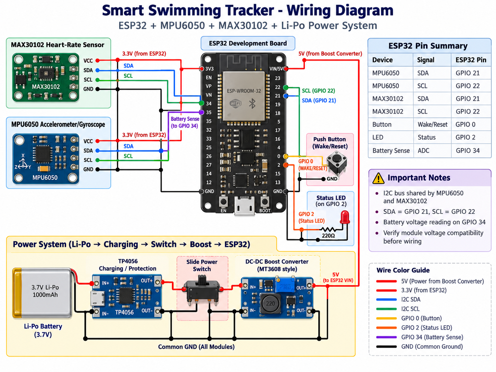
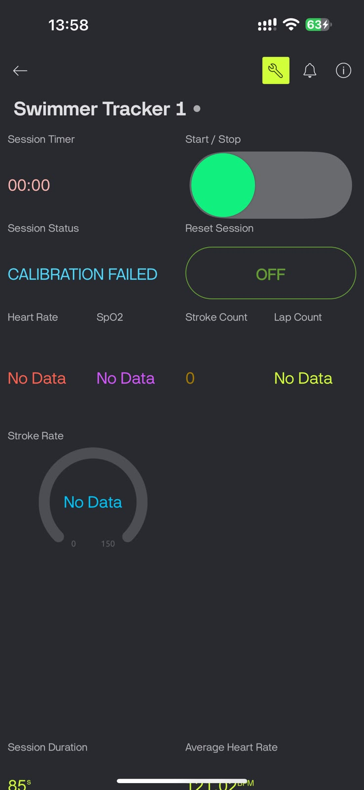
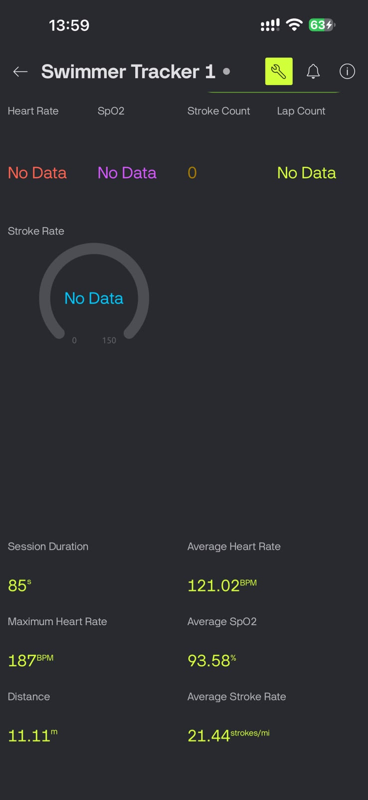

# Smart Swimming Tracker

An embedded IoT wearable designed to monitor swimming performance using motion sensing, heart-rate monitoring, real-time data processing, and cloud connectivity.

## Project Overview

The Smart Swimming Tracker is built around an ESP32 microcontroller and uses multiple sensors to monitor swimmer performance.

The system combines:

- MPU6050 accelerometer and gyroscope
- MAX30102 optical heart-rate sensor
- ESP32 microcontroller
- Li-Po battery power system
- Blynk IoT dashboard

The tracker processes swimmer movement and calculates useful performance metrics such as stroke count, lap count, current speed, average speed, and heart rate.

---

## Main Features

- Stroke detection
- Lap counting
- Current speed estimation
- Average speed calculation
- Heart-rate monitoring
- MPU6050 calibration
- Motion analysis
- Battery monitoring
- Blynk IoT integration
- Deep-sleep power management
- Status LED indication
- Session control

---

## Hardware

Main components used:

- ESP32 development board
- MPU6050 accelerometer and gyroscope
- MAX30102 optical heart-rate sensor
- Li-Po battery
- TP4056 charging and protection module
- DC-DC boost converter
- Slide power switch
- Push button
- Waterproof enclosure

For full hardware documentation:

[View Hardware Documentation](hardware/README.md)

---

## Wiring Diagram



---

## Firmware

The firmware is developed using PlatformIO for the ESP32.

The code is separated into modules for:

- motion sensing
- stroke and lap detection
- heart-rate monitoring
- calibration
- battery monitoring
- LED status control
- storage
- Blynk communication

[View Firmware](firmware/)

---

## System Documentation

Detailed technical documentation includes:

- system architecture
- MPU6050 motion sensing
- sensor calibration
- stroke detection
- lap detection
- speed calculations
- heart-rate monitoring
- power management
- FreeRTOS operation
- limitations and future improvements

[View Technical Documentation](documentation/README.md)

---

## Blynk Dashboard

### Dashboard View 1



### Dashboard View 2



---

## Project Images

Final device and internal hardware images will be added soon.

[View Project Images](images/README.md)

---

## Communication

The MPU6050 and MAX30102 communicate with the ESP32 using I2C.

- SDA: GPIO 21
- SCL: GPIO 22

Other important pins:

- Wake / Reset Button: GPIO 0
- Status LED: GPIO 2
- Battery ADC: GPIO 34

---

## Power System

The tracker is powered using a rechargeable Li-Po battery.

Power flow:

```text
Li-Po Battery
      |
      v
TP4056 Charging / Protection
      |
      v
Slide Power Switch
      |
      v
DC-DC Boost Converter
      |
      v
ESP32 + Sensors
```
Software Technologies
- C / C++
- ESP32
- PlatformIO
- FreeRTOS
- Blynk IoT
- I2C
- Embedded Systems
- Sensor Processing
- Signal Processing

Engineering Challenges
Some of the main challenges during development included:
- false stroke detection
- lap detection reliability
- MPU6050 calibration
- sensor orientation changes
- heart-rate sensor stability
- waterproof enclosure design
- low-power operation
- battery integration
- combining multiple sensors on the same I2C bus

Future Improvements
Possible future improvements include:
- better sensor fusion
- adaptive stroke detection
- improved lap classification
- BLE communication
- dedicated mobile application
- custom PCB design
- smaller enclosure
- improved waterproofing
- lower-power hardware
- machine-learning-based stroke classification
- more advanced swimmer analytics

Author
Sachin Saumya
Electrical & Electronic Engineering Undergraduate
University of Peradeniya
Interested in:
- Embedded Systems
- Sensors
- IoT
- Firmware Development
- Low-Power Devices
- Smartphone Hardware
- Mobile Technology R&D

